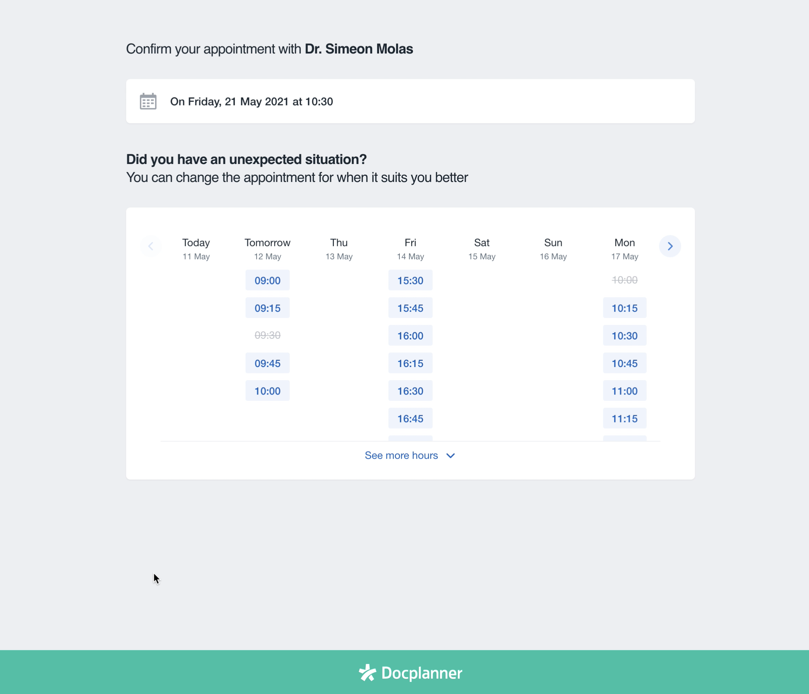

# Doctoralia Technical Test

Welcome onboard!

As you may have already seen, we really like to experiment and iterate here at Scheduler and just now we’re dealing with a new amazing feature for our users: **reschedule an appointment!**

So your first task with us will be to develop a fast prototype for a small app that allows our patients to reschedule an existing appointment. This is the design:



<sup><i>You can see a preview of a working application with all of the features at the end of the readme.</i></sup>

As you can see, when the users access the app they see basic data about the current appointment: the doctor and the date. As initial data, suppose you had an appointment with **Dr. Simeon Molas** on **Friday May 21th at 10:30**.

The available slots for the next seven days are shown, starting from today. Only a few slots are initially shown but there is a button to “See more hours” under them. Some of the slots may be **Taken** so they’re not available to the patient to book.

The user could explore future weeks, but not past weeks, by using the right and left arrows on the header of the calendar. Whenever he finds a slot he’d like to book, he just clicks on it and the appointment and confirm. If the reschedule is successful, the date of the appointment is updated. Since the user clicks the slot until he gets an answer, a loading spinner with crossed-out date to be changed will appear.

In order to get and manipulate the data you’ll have to use our API

Basically the GET where you'll retrieve slots for a maximum of seven days:

- https://draliatest.azurewebsites.net/api/availability/GetWeeklySlots/{yyyyMMdd}

And the POST with an example of the request’s body used on the endpoint:

- https://draliatest.azurewebsites.net/api/availability/BookSlot

```
{
  "Start": Start timestamp (string "YYYY-MM-DD HH:mm:ss"),
  "End": End timestamp (string "YYYY-MM-DD HH:mm:ss"),
  "Comments": Additional instructions for the doctor (string),
  "Patient" : {
    "Name" : Patient Name (string),
    "SecondName" : Patient SecondName (string),
    "Email" : Patient Email (string),
    "Phone" : Patient Phone (string)
  }
}
```

## Notes

Keep in mind that this is a prototype, we don’t expect from you to get the best possible solution but the best you could do **in a few hours**, so your criteria is important. **The solution should work for every day of the week**.

Although it’s just a prototype, we’d like to see some structure on your code because, as you may know, sometimes prototypes grow too much ;)

Animations on going forward, backward or on see more slots are not mandatory.

In order to make it easier for you, we’ll provide a boilerplate you can start the project with. Feel free to use any library that it could fit to your solution. Also boilerplate could be outdated, don't hesitate to update it or totally remove it.

#### To start from boilerplate you can execute:

```
yarn install && yarn serve
```

## Preview

